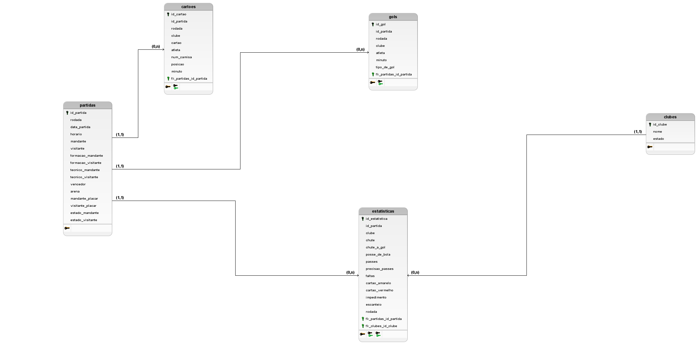

<!DOCTYPE html>
<html xmlns="http://www.w3.org/1999/xhtml">
  <head>
    <meta charset="utf-8" /></head
  ><head></head>
  <body>
    

      

        <h1>Campeonato Brasileiro de Futebol</h1>
        

        Este projeto utiliza um dataset com dados reais do <a href="https://www.kaggle.com/datasets/adaoduque/campeonato-brasileiro-de-futebol" target="_blank">Campeonato Brasileiro de Futebol</a>, 
        abrangendo um total de 8.404 partidas realizadas entre os anos de 2003 e 2023. 
        A iniciativa visa a criação de uma modelagem conceitual e a implementação de um banco de dados robusto utilizando o SGBD MySQL. 
        O objetivo principal é possibilitar a realização de consultas detalhadas e precisas sobre os dados do campeonato, 
        proporcionando uma ferramenta valiosa para análises e estudos aprofundados no contexto esportivo. 
        Este projeto reflete um compromisso com a precisão e a integridade dos dados, 
        oferecendo uma base sólida para a exploração de informações históricas do futebol brasileiro.
         
        Para estruturar e organizar adequadamente essas informações, foi desenvolvida uma modelagem lógica do banco de dados, 
        que serviu como base para a implementação de um banco de dados relacional no SGBD MySQL. 
        A partir dessa modelagem, foram criadas as tabelas, os relacionamentos e inseridos os dados correspondentes, 
        permitindo a realização de consultas analíticas e operacionais sobre o contexto explorado. 
        Este projeto visa, portanto, proporcionar uma abordagem sistemática e eficiente para o armazenamento 
        e a consulta de dados históricos do campeonato, viabilizando o suporte a análises detalhadas e consultas dinâmicas 
        sobre os resultados e informações pertinentes ao período coberto.
        

      

      

        <h2>Objetivos</h2>
        

          A atividade consiste em criar a modelagem conceitual e um banco de
          dados a partir de uma fonte de dados real. O banco de dados deve ser
          criado utilizando o SGBD MySQL. O objetivo do banco de dados é
          possibilitar a realização de consultas relativas aos dados do contexto
          explorado.
        

        <h2>Requisitos</h2>
        <ul>
          <li>Devem ser criadas pelo menos 5 tabelas (tabelas para relacionamentos N:M não contam);</li>
          <li>Cada tabela deve ter ao menos 2 colunas;</li>
          <li>Cada tabela deve conter no mínimo 50 registros armazenados;</li>
          <li>Os dados armazenados devem ser retirados de uma fonte real, indicada no relatório do trabalho;</li>
        </ul>
        <h2>Modelo Lógico</h2>
        
        <h2>Como Usar</h2>
        

            Se você deseja utilizar o código Typescript para gerar os scripts de inserts SQL você pode seguir este passos
        

        <ol>
          <li>
            <strong>Clonar o repositório:</strong> Para clonar o repositório,
            execute o seguinte comando em seu terminal (Obs: necessário ter o
            <a href="https://git-scm.com/downloads">git</a> instalado em sua
            máquina):
            <pre><code>git clone https://github.com/itsryu/AT2-N1-LBD.git</code></pre>
          </li>
          <blockquote>
            <strong>⚠ Atenção:</strong> Para executar os próximos comandos (<code>npm</code>), é necessário que o Node.js esteja instalado em sua máquina.
            Recomendo a versão <strong>LTS</strong> (Long Term Support), que pode ser encontrada no site oficial: 
            <a href="https://nodejs.org/pt" target="_blank">Node.js</a>.
          </blockquote>
          <li>
            <strong>Instalação:</strong> Abra o terminal no projeto e execute o 
            seguinte código (Se você utiliza <a href="https://classic.yarnpkg.com/lang/en/docs/install/#windows-stable" target="_blank">yarn</a> como gerenciador de pacotes, utilize a segunda linha de comando):
            <pre><code>npm install</code></pre>
            <pre><code>yarn install</code></pre>
          </li>
          <li>
            <strong>Compilação:</strong> Para compilar o arquivo utilize:
            <pre><code>npm run build</code></pre>
            <pre><code>yarn build</code></pre>
          </li>
          <li>
            <strong>Execução:</strong> Após a compilação, execute o arquivo para inicializar o programa:
            <pre><code>npm run start</code></pre>
            <pre><code>yarn start</code></pre>
          </li>
          <li>
            <strong>Arquivos</strong> Após a execução os arquivos serão gerados no diretório
            ./sql
          </li>
        </ol>
        <h2>Ferramentas de desenvolvimento utilizadas</h2>
        <ol>
          <li>
            <strong>Visual Studio Code</strong> 
            (Utilizada para o desenvolvimento do código Typescript dos scripts SQL)
          </li>
          <li>
            <strong>MySQL Workbench</strong> 
            (Utilizada para a criação do banco de dados, criação das tabelas e inserções dos dados criados)
          </li>
          <li>
            <strong>GitHub</strong>
            (Utilizada para o versionamento)
          </li>
        </ol>
        <h2 align="center">Desenvolvedores</h2>
        <table align="center">
          <thead>
            <tr>
              <th align="center">Nome</th>
              <th align="center">Github</th>
              <th align="center">Matricula</th>
            </tr>
          </thead>
          <tbody>
            <tr>
              <td align="center">João Victor</td>
              <td align="center">
                <a href="https://github.com/itsryu">@itsryu</a>
              </td>
              <td align="center">UC23103118</td>
            </tr>
            <tr>
              <td align="center">Breno Gonçalves</td>
              <td align="center">
                <a href="https://github.com/Breno-G">@Breno-G</a>
              </td>
              <td align="center">UC23103129</td>
            </tr>
            <tr>
              <td align="center">Rogério Teixeira</td>
              <td align="center">
                <a href="https://github.com/G3rin">@G3rin</a>
              </td>
              <td align="center">UC23200885</td>
            </tr>
            <tr>
              <td align="center">Ramon Oliveira</td>
              <td align="center">
                <a href="https://github.com/Ramozinhu316">@Ramozinhu316</a>
              </td>
              <td align="center">UC23101322</td>
            </tr>
            <tr>
              <td align="center">Nichollas Holz</td>
              <td align="center">
                <a href="https://github.com/NickDevHolz">@NickDevHolz</a>
              </td>
              <td align="center">UC23200092</td>
            </tr>
          </tbody>
        </table>
      

    

  </body>
</html>